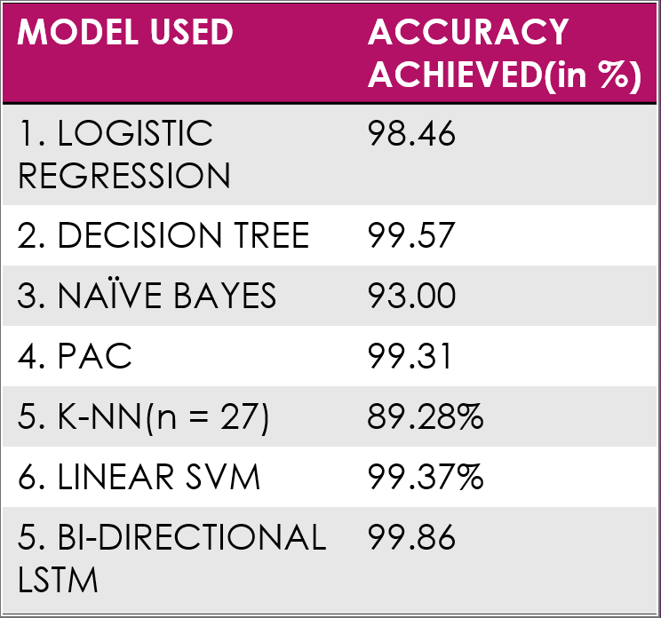

# Fake-News-Detection
Fake news is a news story that is deliberately created fake, increasingly transforming into a danger to the society. The main objective is to detect false/fake news through various machine learning techniques like Bi-directional LSTM and other fundamental algorithms such as Decision Tree etc with greater accuracy and draw a comparison of accuracies achieved

## Problem Statement
With the recent development of media-based platforms like Instagram, Facebook and Twitter and how modest Internet is, that even the remote villages have access to it, it has gotten even simpler to escalate any information to the community in no time, and how it can be life threatening as there is no credibility of these news stories. Therefore, something needs to be done to reduce the reach and effect of false and triggering information spread to the millions of users.

## Dataset
For the implementation of this project, I have used ISOT Dataset available on the official website of University of Victoria which is a compilation of several thousands fake news and truthful articles, obtained from different legitimate news sites and sites flagged as unreliable by Politifact.com.

#### Dataset Link 
https://www.uvic.ca/ecs/ece/isot/datasets/fake-news/index.php

#### Comparison Chart

